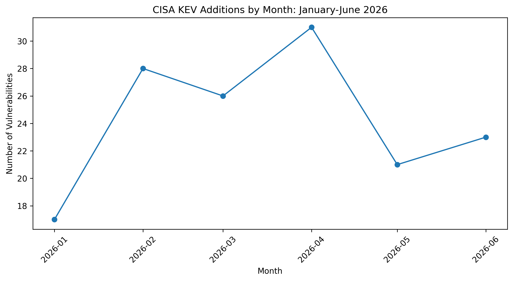
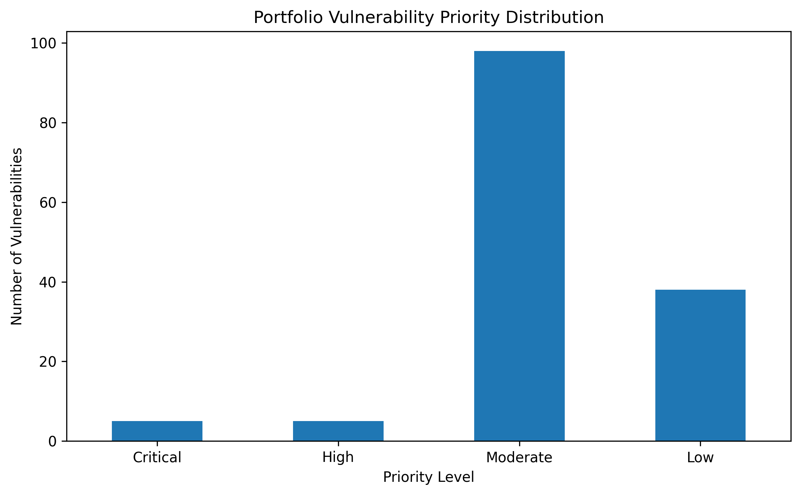
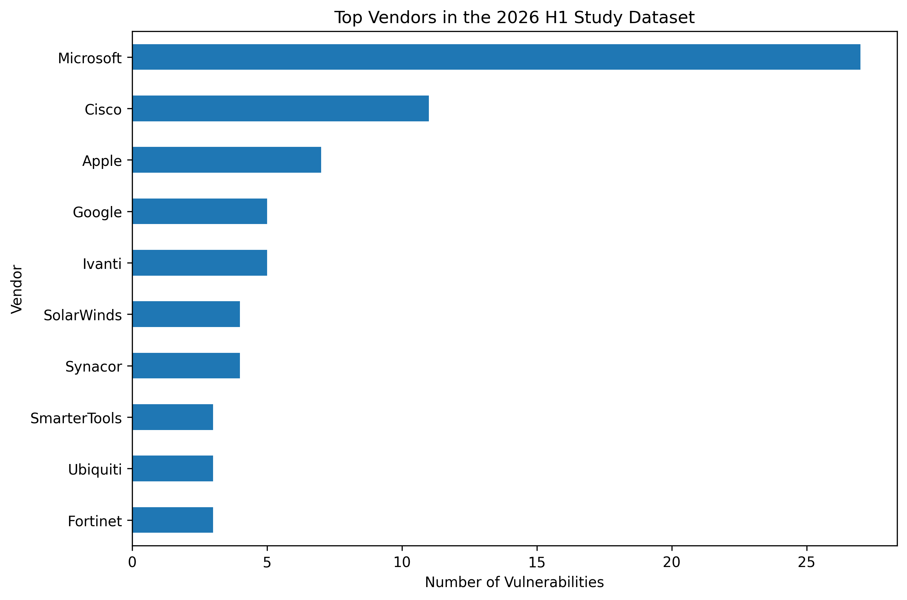

# Healthcare Threat Intelligence Assessment

## Executive summary

This portfolio project evaluates actively exploited vulnerabilities relevant to a fictional regional healthcare organization. It uses CISA Known Exploited Vulnerabilities data, a transparent prioritization framework, manual analyst review, and MITRE ATT&CK mapping.

## Intelligence question

Which actively exploited vulnerabilities present the greatest near-term operational risk to a midsized healthcare organization?

## Scenario

Northstar Regional Health is fictional. The project does not analyze or make claims about a real organization's infrastructure.

## Key findings

1. The highest-priority findings affect remote access, enterprise email, and centralized firewall management.
2. The three selected case studies received final scores of 16 and were classified Critical.
3. Internet reachability and centralized administrative control increase potential operational impact.
4. Product relevance must be confirmed against a real asset inventory.

## Dataset

- Records analyzed: 146
- Unique vendors: 69
- Study period: January 1-June 30, 2026
- Critical findings: 5
- High findings: 5
- Known ransomware association: 19

## Priority case studies

- CVE-2026-0257 - Palo Alto Networks PAN-OS GlobalProtect authentication bypass
- CVE-2023-21529 - Microsoft Exchange Server deserialization remote code execution
- CVE-2026-20131 - Cisco Secure Firewall Management Center remote code execution

## Featured visuals

## Repository contents

- `data/processed` - Final scored dataset
- `docs` - Vulnerability research, methodology, and source register
- `attack-navigator` - ATT&CK Navigator layer
- `reports` - Executive and technical reports
- `visuals` - Portfolio charts
- `notebooks` - Add your completed Colab notebook here

## Skills demonstrated

Cyber threat intelligence, vulnerability prioritization, OSINT research, MITRE ATT&CK mapping, Python, pandas, data visualization, intelligence writing, healthcare risk analysis, confidence assessment, and intelligence-gap documentation.

## Ethical scope

This is a defensive project based on public data and a fictional organization. It does not include unauthorized access, exploit development, malware execution, or protected health information.

## Author

**Kyria Santa**  
MPH in Epidemiology | ISC2 Certified in Cybersecurity  
Portfolio: https://my.visme.co/view/dwov7n1k-kyria-santa-data-science-portfolio
